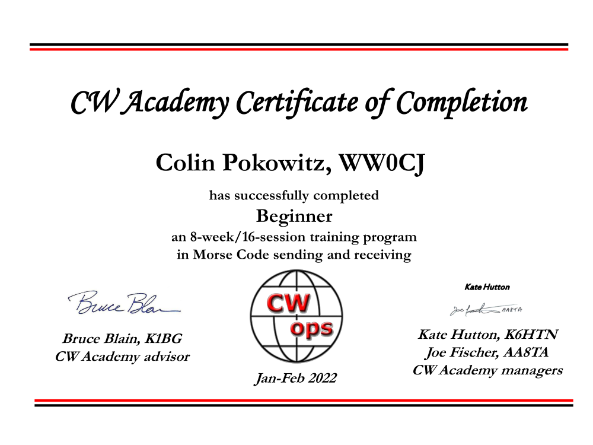

At the time of posting this I have finished CW Academy's Beginner level in the Jan/Feb 2022 session! The Beginner course walks you through all the letters and numbers to get you familiar with the code, and then walks you through basic on-air QSOs. At the end of my time in the class, I was able to ragchew on the air at 12wpm (with a little farnsworth)!

Big thanks to Bruce, K1BG for being such a great advisor and being willing to help down to the specific interests including practicing contest running! And also thanks to the entire CWOps team for putting together this course to engage all hams, young and old in the code.

I'm currently trying to figure out what the next step in morse code is for me, but I hope to continue making posts here on the future of my radio operations.

