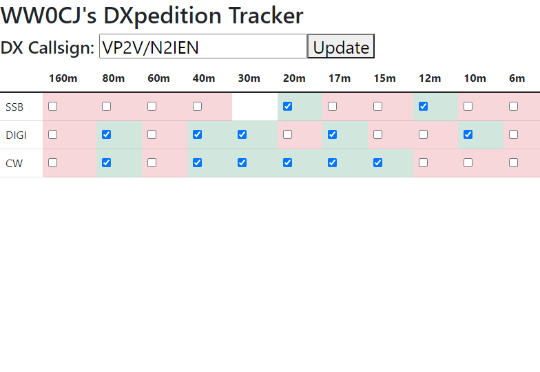

The crew at Remote Ham Radio went on a DXpedition this week, operating from the British Virgin Islands under the callsign VP2V/N2IEN. 

Many operators in my friend group spent their week hunting week-long station on all bands and all modes. One even made a spreadsheet to track the band/mode slots he had not worked yet, and I followed suit.

With the event coming to a close, I decided to spend my night making a "better" tracker than an Excel spreadsheet for seeing what slots you still need a station on. 

Over the course of around 2 hours, I threw together a quick DXpedition tracker for me and friends to use for the next one. It is very janky and very bug filled and doesn't look too great in this version. I'm sure the next DXpedition I try to work this much will motivate me to continue working on the program more.

If you want to use the program, bugs and all, feel free to download it at my [Github](https://github.com/cjtheham/dxpedition-tracker). Contributions and pull requests are welcome, software is provided as is with no warranties.

Live long and prosper, 73 de WW0CJ