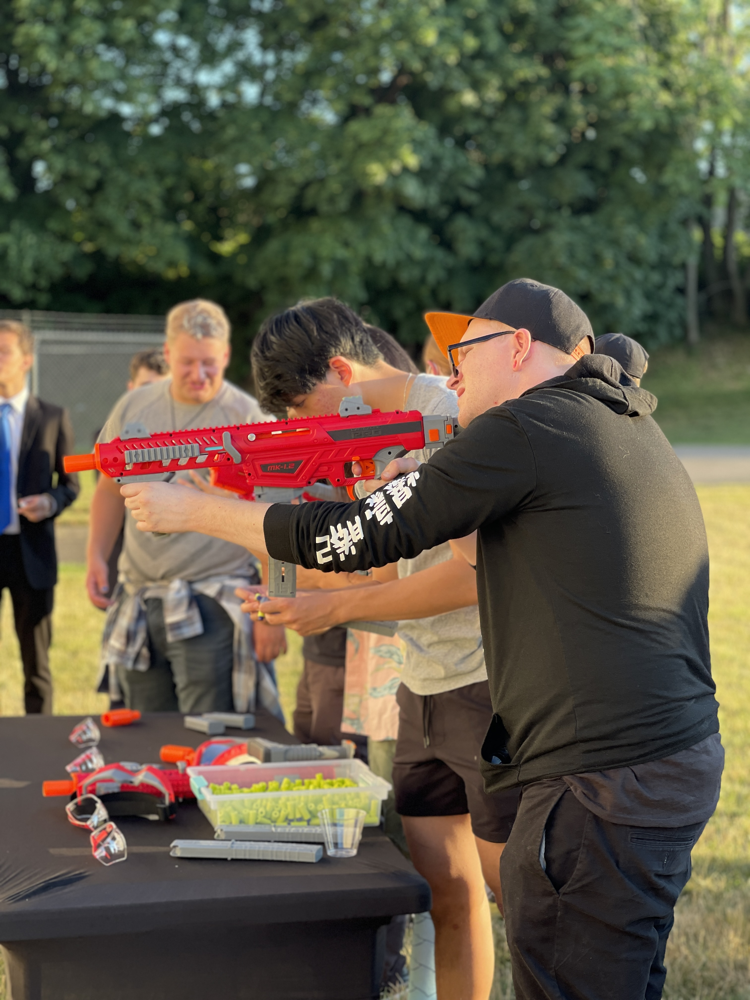
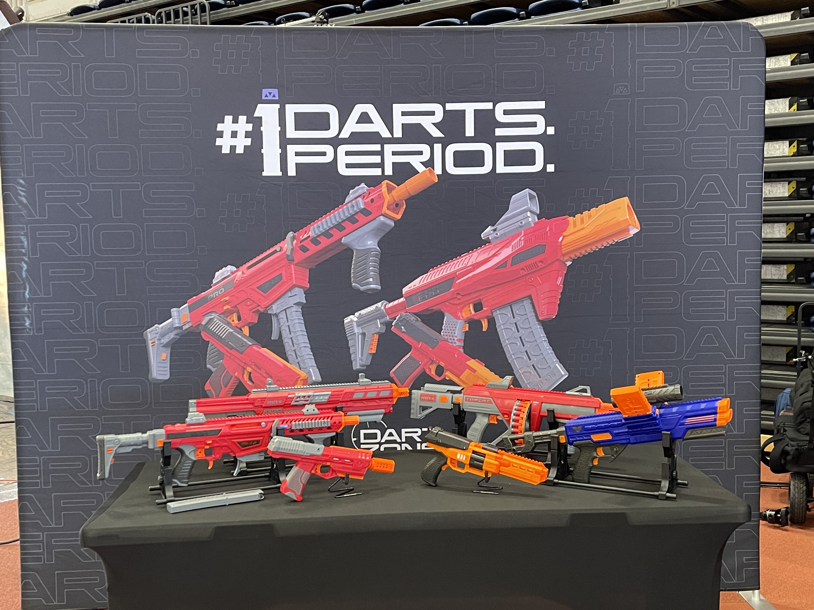
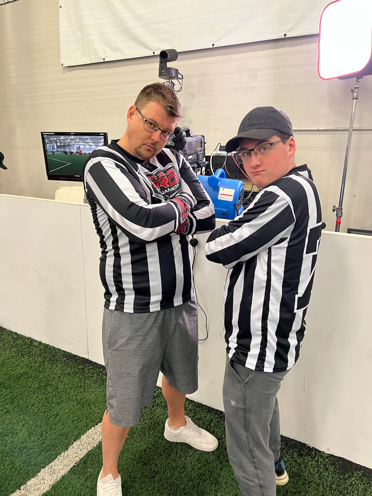

I had the honor this year to attend what I like to describe as the best foam-flinging weekend in 2022. In combining HvZ Endwar, FoamCon, and the Dart Zone Pro Tournament, the weekend brought hundreds of dart blaster fans out to Rochester, NY for an awesome time.

## Day 1

Day 1 was all about Dart Zone. I got to sit and watch the fourth qualifier of the Foam Pro Tour to start the morning off, which was awesome. So many great teams came out to compete, and the hype was real. I was especially interested in the awesome custom blasters that were brought out and played with, such as [Eli Wu's Impulse AEG Blaster](https://www.youtube.com/watch?v=GI_WEKZ9jkI).

After the qualifier match was all done, we got to head over to Radio Social to hang out with the winning teams and play with some new blasters. One of the coolest parts of this weekend was being able to see all the energy and excitement surrounding this hobby. Every new product is showered in creativity as soon as the players get their hands on it, trying to come up with modifications and improvements for the competitions. It's awesome to watch and hear the instant feedback when these guys get out in the field and start firing off some darts. 

*One of my favorite pics I took all weekend. If anyone knows which player this is let me know! Staring down the sights of the MK1.2 getting ready to fire. Shot in Portrait Mode on an iPhone 12 Pro Max.*

## Day 2

Day 2 for me marked FoamCon, where I was able to hang out at the Dart Zone booth for most of the day and help visitors try out the new blaster lineup and get a chance to fire them off at some targets. Once again, the enthusiasm for dart blasters was off the charts at this event, and I got to hear tons of cool feedback on every blaster. The Hydro-Strike blasters were also on display, and everyone was blown away when given the chance to play with the Pulsar Pro. 

There were a ton of cool booths showing off modded and custom blasters! I hope to be able to come back next year and maybe pick up some new blasters and get to know that part of the community a bit more. 

## Day 3

On the final day, I had the opportunity to attend and be a referee at the championship game for the Dart Zone Pro Tournament. I don't have too many pictures as I was busy with ref duties, but it was awesome seeing all of the teams bring their A-game in this event, and I think Dart Zone has introduced a new wave of pro-level gameplay to the hobby. I'm excited to see how the tournament will progress next year, and can't wait to see the improvements specifically from a gameplay perspective.

I know the final games didn't go as many of the teams would have appreciated, and I wish more could have gone in from the refs side in order to combat these challenges. Even though there was a lot of concerns, I think overall people had a great time just being able to get on the field and play and I hope the community can bring even more energy and passion to next year's events.

## Other Happenings

I had hoped to play in Endwar this year, but sadly the only blaster I had brought with me was a modified DZ MK-III that was well over the FPS limits set for the event. I did however get a chance to walk around the RIT campus and witness a small portion of the game, and it looked like a ton of fun! It has inspired me to look into not only attending next year but also looking into starting my own local HvZ game!

This post was just to help get me started on this blog, so I haven't put too much editing into this! If you find any issues, let me know!

\- Rogue