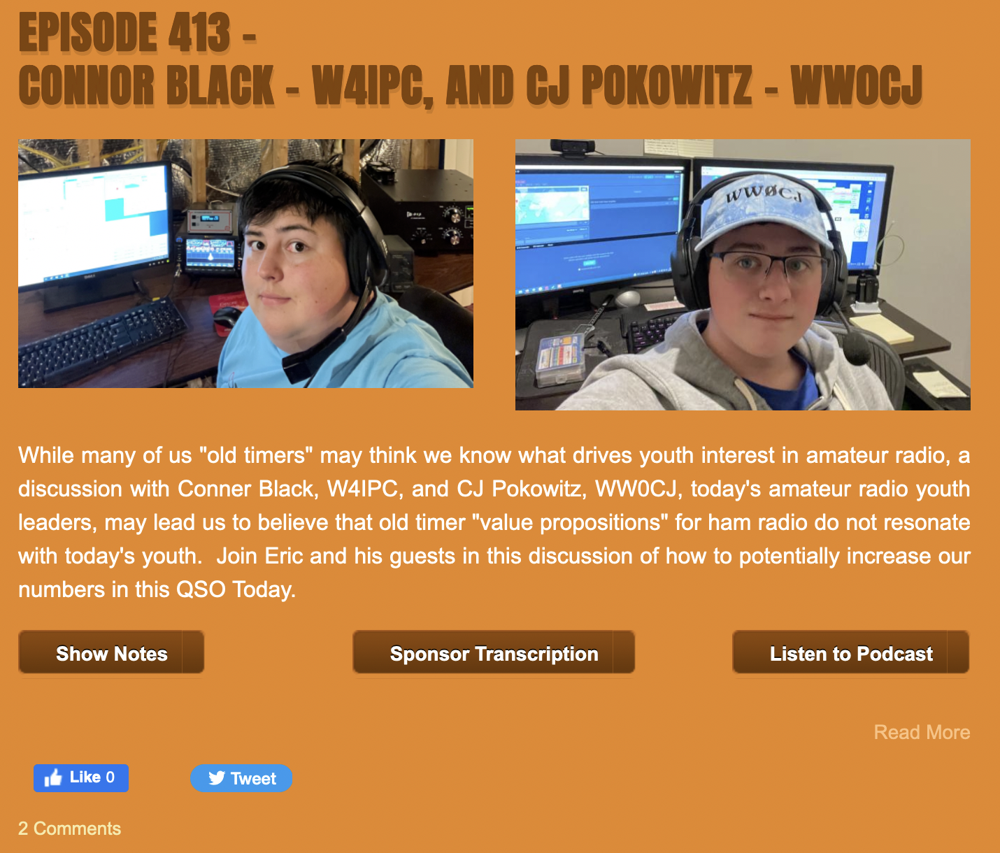

I had the wonderful opportunity recently to go on the QSO Today Podcast hosted by Eric, 4Z1UG. Myself, along with Connor W4IPC got an opportunity to talk about what we believe is causing less youth participation in amateur radio, and how the older generation of hams can connect with youth.

Find the episode and show notes or at the link below, or search for "QSO Today" on your favorite podcasting platform and look for episode 413.

[QSO Today Episode 413](https://www.qsotoday.com/podcasts/w4ipc_ww0cj)

"While many of us "old timers" may think we know what drives youth interest in amateur radio, a discussion with Conner Black, W4IPC, and CJ Pokowitz, WW0CJ, today's amateur radio youth leaders, may lead us to believe that old timer "value propositions" for ham radio do not resonate with today's youth. Join Eric and his guests in this discussion of how to potentially increase our numbers in this QSO Today." - Eric Guth, 4Z1UG