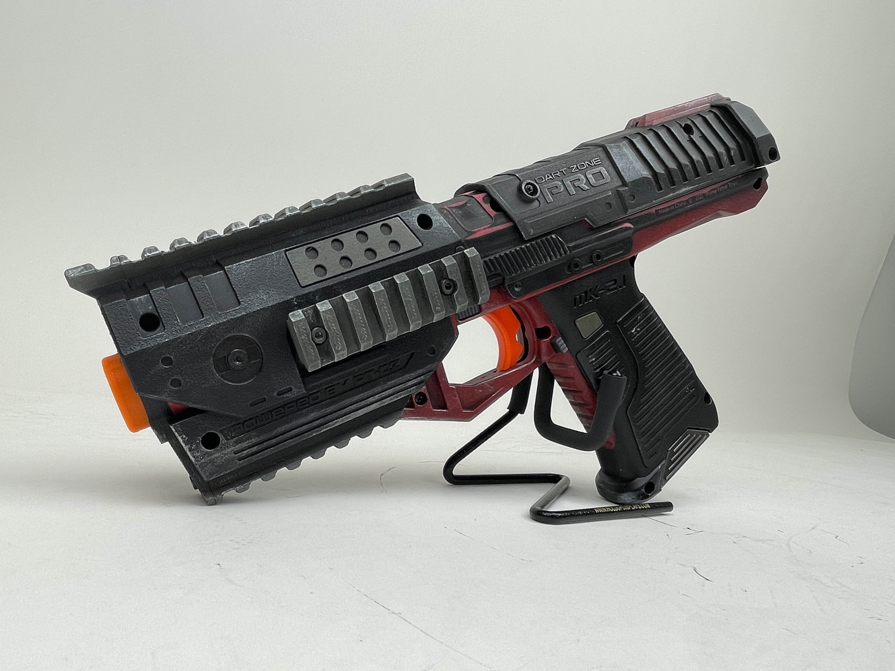
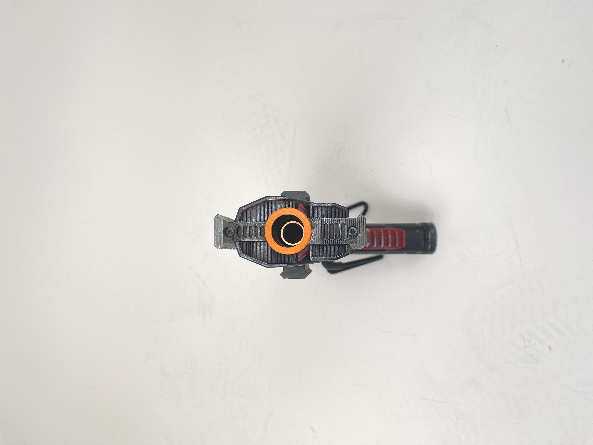
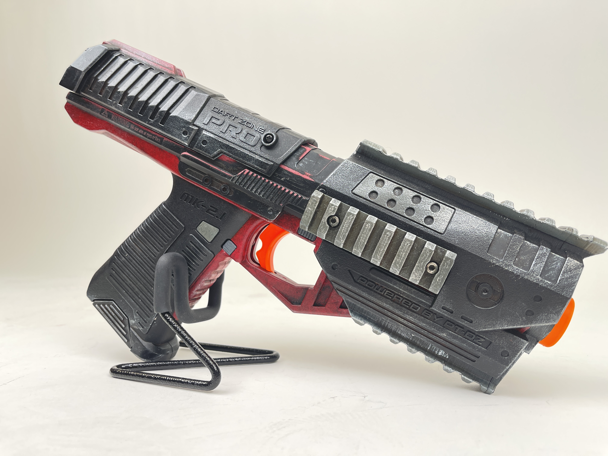

The MK2.1 has been my favorite blaster release of 2022. After being able to play with it at FoamCon in Rochester, NY, I fell in love with the same mechanics I loved with the MK2 but the nice addition of a magazine over top-loading. I got my hands on one after the tournament and made some modifications to make it even better.

To begin, I went ahead and purchased the modifications offered by [Foam Pro Shop](https://foamproshop.com/products/mk-2-1-kit?_pos=1&_sid=95f4fea50&_ss=r "Foam Pro Shop"). Their additions to this blaster included a replacement muzzle with picatinny rails on **both** the top and the bottom. This will now allow me to not only run a scope but other potential options like a laser pointer or flashlight mounted underneath the barrel. The kit also included a rail for each side of the blaster, which gives it a nice aesthetic look but I'm not sure how I'll end up using these yet. If you have any suggestions, please feel free to let me know!

In terms of modifications to the functionality of the blaster, I used the same kit from FPS to remove the safety and extend the mag release. I'm usually not a fan of removing the safety just for safety reasons ;-) but I felt like I was able to easily bump it on accident and cause the trigger to lock up mid-game. The mag release was an especially big deal because the major complain on the blaster is having to move your hand to drop the magazine. I find that now, while I still do have to move my hand a bit, it is a lot easier and more comfortable to use!

After completing the modifications, my roommate (who sadly refuses to use social media, so no way to mention his other work :() went along with painting it. He specializes in painting miniatures for Dungeons & Dragons and Warhammer 40k, so this was a larger scale project for him and he tackled it incredibly. We took inspiration off of a battle-worn blaster from the likes of Mass Effect or other sci-fi interpretations. 

The one issue I ran into was a very _very_ tight prime after painting. I managed to smooth this up with some sanding underneath the slide, but I'm not sure of any other remedies I can try to make it buttery smooth to pull.

While I don't think I'll be using this blaster much in the field, due to it being mostly black and the priming tightness, it looks incredible and I can't wait to have it stay in my collection.

Let me know what you think of the blaster, and your thoughts on the MK2.1 in general. I'd love to hear your comments!

You can find me on Mastodon ([@RogueFoam@defcon.social](https://defcon.social/@roguefoam)) or Instagram ([@roguefoam574](https://www.instagram.com/roguefoam574/)).

Happy Holidays and Happy New Year!

\- Rogue